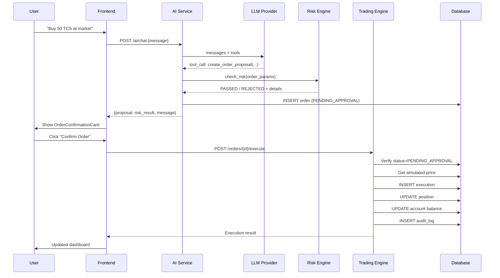
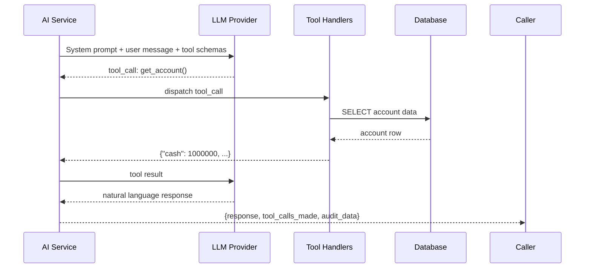

# 03 — Architecture

## System Overview

```
┌─────────────────────────────────────────────────────────────────┐
│                         User (Browser)                          │
└───────────────────────────────┬─────────────────────────────────┘
                                │ HTTPS / REST
┌───────────────────────────────▼─────────────────────────────────┐
│                       Next.js Frontend                           │
│                                                                  │
│  ┌─────────────────┐  ┌────────────────┐  ┌──────────────────┐  │
│  │  Dashboard Page  │  │  Copilot Page  │  │  Orders Page     │  │
│  │  Portfolio view  │  │  Chat + Order  │  │  History + Audit │  │
│  │  P&L charts      │  │  Confirmation  │  │  Execution log   │  │
│  └─────────────────┘  └────────────────┘  └──────────────────┘  │
└───────────────────────────────┬─────────────────────────────────┘
                                │ REST API (JSON)
┌───────────────────────────────▼─────────────────────────────────┐
│                      FastAPI Backend                             │
│                                                                  │
│  ┌──────────────────────────────────────────────────────────┐   │
│  │                      API Router                          │   │
│  │  /health  /account  /market  /orders  /ai  /audit        │   │
│  └──────────────────┬───────────────────────────────────────┘   │
│                     │                                            │
│  ┌──────────────────▼──────────────┐                            │
│  │          Service Layer          │                            │
│  │  ┌───────────┐ ┌─────────────┐  │                            │
│  │  │ AI Service│ │Account Svc  │  │                            │
│  │  │ LLM calls │ │Portfolio Svc│  │                            │
│  │  └─────┬─────┘ └─────────────┘  │                            │
│  │        │                        │                            │
│  │  ┌─────▼──────┐ ┌─────────────┐ │                            │
│  │  │Risk Engine │ │Trading Eng. │ │                            │
│  │  │Deterministic│ │Paper Exec.  │ │                            │
│  │  └────────────┘ └─────────────┘ │                            │
│  └─────────────────────────────────┘                            │
│                                                                  │
│  ┌──────────────────────────────────────────────────────────┐   │
│  │                   PostgreSQL Database                     │   │
│  │  users · accounts · instruments · orders · executions    │   │
│  │  positions · transactions · risk_rules · audit_logs      │   │
│  └──────────────────────────────────────────────────────────┘   │
└─────────────────────────────────────────────────────────────────┘
```

---

## Frontend Architecture

**Framework**: Next.js 15 (App Router)  
**Language**: TypeScript  
**Styling**: Tailwind CSS  
**State**: React hooks + Context API  
**HTTP**: Axios / fetch with typed API client  

### Page Structure

```
frontend/src/app/
├── layout.tsx           # Root layout, providers
├── page.tsx             # Dashboard (redirect or home)
├── dashboard/
│   └── page.tsx         # Portfolio overview
├── copilot/
│   └── page.tsx         # AI chat + order flow
├── orders/
│   └── page.tsx         # Order history
└── audit/
    └── page.tsx         # Audit log
```

### Component Architecture

```
components/
├── layout/
│   ├── Sidebar.tsx
│   ├── Header.tsx
│   └── Navigation.tsx
├── dashboard/
│   ├── PortfolioSummary.tsx
│   ├── PositionsTable.tsx
│   ├── PnLChart.tsx
│   └── AllocationChart.tsx
├── copilot/
│   ├── ChatInterface.tsx
│   ├── MessageBubble.tsx
│   └── OrderConfirmationCard.tsx
└── shared/
    ├── Badge.tsx
    ├── PriceDisplay.tsx
    └── LoadingState.tsx
```

---

## Backend Architecture

**Framework**: FastAPI  
**Language**: Python 3.13  
**ORM**: SQLAlchemy 2.0 (async)  
**Validation**: Pydantic v2  
**Migrations**: Alembic  

### Layer Responsibilities

| Layer | Responsibility |
|-------|---------------|
| API Routes | HTTP interface, input parsing, response formatting |
| Services | Business logic, orchestration |
| Risk Engine | Deterministic rule evaluation (no LLM) |
| Trading Engine | Order lifecycle, paper execution, P&L |
| AI Layer | LLM communication, tool call parsing, system prompt |
| Models | SQLAlchemy ORM models |
| Schemas | Pydantic request/response schemas |

### Directory Structure

```
backend/app/
├── main.py              # FastAPI app entry
├── config.py            # Settings from env vars
├── database.py          # DB connection, session
├── seed.py              # Demo data seeder
├── api/
│   ├── health.py
│   ├── account.py
│   ├── market.py
│   ├── orders.py
│   ├── ai.py
│   └── audit.py
├── models/              # SQLAlchemy models
│   ├── user.py
│   ├── account.py
│   ├── instrument.py
│   ├── order.py
│   ├── execution.py
│   ├── position.py
│   └── audit_log.py
├── schemas/             # Pydantic schemas
│   ├── account.py
│   ├── order.py
│   ├── market.py
│   └── ai.py
├── services/
│   ├── account_service.py
│   ├── market_service.py
│   └── portfolio_service.py
├── trading/
│   ├── engine.py        # Paper execution
│   └── simulator.py     # Price simulation
├── risk/
│   └── engine.py        # Deterministic risk rules
└── ai/
    ├── copilot.py       # LLM orchestration
    ├── tools.py         # Tool definitions
    └── prompts.py       # System prompts
```

---

## Data Flow Diagrams

### Order Flow



### AI Tool Call Flow



---

## AI Safety Architecture

```
LLM Output (UNTRUSTED)
        │
        ▼
Tool Call Parser
        │ validates: tool name exists?
        │            arguments well-formed?
        │            types correct?
        ▼
Tool Handler (per tool)
        │ validates: symbol in allowed list?
        │            quantity > 0?
        │            price in valid range?
        ▼
Service Layer
        │ validates: account exists?
        │            business rules?
        ▼
Risk Engine (DETERMINISTIC)
        │ evaluates: cash sufficient?
        │            exposure limits?
        │            daily loss limit?
        ▼
Order Proposal (stored in DB)
        │
        ▼
User Confirmation (MANDATORY)
        │
        ▼
execute_approved_order()
   - verifies proposal_id exists
   - verifies status = PENDING_APPROVAL
   - verifies user ownership
   - executes paper trade
```

---

## Database Architecture

See [06-DATABASE.md](06-DATABASE.md) for full schema.

Key relationships:
```
users → accounts (1:1)
accounts → positions (1:many)
accounts → orders (1:many)
orders → executions (1:many)
executions → transactions (1:1)
instruments → market_ticks (1:many)
orders → audit_logs (1:many)
```

---

## Future Architecture (Phase 7)

The trading engine is architected to allow a C++ replacement:

```
FastAPI
    │
    ▼ (Python FFI / gRPC)
C++ Trading Engine
    │
    ├── Order Book (per symbol)
    ├── Matching Engine
    └── Execution Reports
```

The Python trading engine implements the same interface, so the swap is transparent to the rest of the system.
