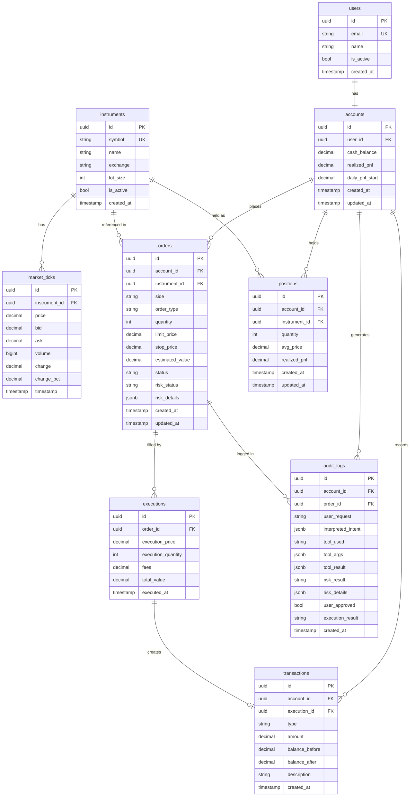

# 06 — Database

## Overview

PostgreSQL 16 is used as the primary database.  
ORM: SQLAlchemy 2.0 (async)  
Migrations: Alembic  

---

## Schema

### ER Diagram



---

## Table Details

### users

| Column | Type | Constraints | Notes |
|--------|------|-------------|-------|
| id | UUID | PK | Auto-generated |
| email | VARCHAR(255) | UK, NOT NULL | Demo: demo@tradingcopilot.ai |
| name | VARCHAR(255) | NOT NULL | Display name |
| is_active | BOOLEAN | DEFAULT true | Soft delete |
| created_at | TIMESTAMP | NOT NULL | UTC |

### accounts

| Column | Type | Constraints | Notes |
|--------|------|-------------|-------|
| id | UUID | PK | |
| user_id | UUID | FK users.id | |
| cash_balance | NUMERIC(15,2) | NOT NULL | Available cash |
| realized_pnl | NUMERIC(15,2) | DEFAULT 0 | Cumulative realized P&L |
| daily_pnl_start | NUMERIC(15,2) | NOT NULL | Snapshot at day start |
| created_at | TIMESTAMP | NOT NULL | |
| updated_at | TIMESTAMP | NOT NULL | Auto-updated |

### instruments

| Column | Type | Constraints | Notes |
|--------|------|-------------|-------|
| id | UUID | PK | |
| symbol | VARCHAR(20) | UK, NOT NULL | NSE symbol |
| name | VARCHAR(255) | NOT NULL | Company name |
| exchange | VARCHAR(10) | DEFAULT 'NSE' | |
| lot_size | INTEGER | DEFAULT 1 | Min trade unit |
| is_active | BOOLEAN | DEFAULT true | Tradeable? |

**Seeded instruments:** RELIANCE, TCS, INFY, HDFCBANK, ICICIBANK, SBIN, ITC, TATAMOTORS

### market_ticks

| Column | Type | Notes |
|--------|------|-------|
| id | UUID | |
| instrument_id | UUID FK | |
| price | NUMERIC(12,2) | Last traded price |
| bid | NUMERIC(12,2) | Best bid |
| ask | NUMERIC(12,2) | Best ask |
| volume | BIGINT | Day volume |
| change | NUMERIC(10,2) | Absolute change from prev close |
| change_pct | NUMERIC(6,4) | Percentage change |
| timestamp | TIMESTAMP | Tick time |

**Indexes:** `(instrument_id, timestamp DESC)` for latest price queries.

### orders

| Column | Type | Notes |
|--------|------|-------|
| id | UUID | |
| account_id | UUID FK | |
| instrument_id | UUID FK | |
| side | VARCHAR(4) | BUY / SELL |
| order_type | VARCHAR(10) | MARKET / LIMIT / STOP |
| quantity | INTEGER | Must be > 0 |
| limit_price | NUMERIC(12,2) | NULL for MARKET |
| stop_price | NUMERIC(12,2) | For STOP orders |
| estimated_value | NUMERIC(15,2) | At order creation time |
| status | VARCHAR(20) | See statuses below |
| risk_status | VARCHAR(10) | PASSED / REJECTED |
| risk_details | JSONB | Risk rule results |
| created_at | TIMESTAMP | |
| updated_at | TIMESTAMP | |

**Order Statuses:**
- `PENDING_APPROVAL` — Created, awaiting user confirmation
- `CANCELLED` — Cancelled by user or system
- `REJECTED` — Risk engine rejected
- `OPEN` — Confirmed, in market (for limit orders)
- `PARTIALLY_FILLED` — Partially executed
- `FILLED` — Fully executed

### executions

| Column | Type | Notes |
|--------|------|-------|
| id | UUID | |
| order_id | UUID FK | |
| execution_price | NUMERIC(12,2) | Actual fill price |
| execution_quantity | INTEGER | Shares filled |
| fees | NUMERIC(10,2) | Brokerage fees |
| total_value | NUMERIC(15,2) | price × qty + fees |
| executed_at | TIMESTAMP | |

### positions

| Column | Type | Notes |
|--------|------|-------|
| id | UUID | |
| account_id | UUID FK | |
| instrument_id | UUID FK | |
| quantity | INTEGER | Current holding (0 = closed) |
| avg_price | NUMERIC(12,2) | Weighted average cost |
| realized_pnl | NUMERIC(15,2) | Realized from this position |
| created_at | TIMESTAMP | |
| updated_at | TIMESTAMP | |

**Unique constraint:** `(account_id, instrument_id)` — one position per instrument per account.

### transactions

| Column | Type | Notes |
|--------|------|-------|
| id | UUID | |
| account_id | UUID FK | |
| execution_id | UUID FK | May be NULL for manual adjustments |
| type | VARCHAR(20) | BUY_FILL / SELL_FILL / FEE |
| amount | NUMERIC(15,2) | Positive = credit, negative = debit |
| balance_before | NUMERIC(15,2) | Cash before transaction |
| balance_after | NUMERIC(15,2) | Cash after transaction |
| description | TEXT | Human-readable description |
| created_at | TIMESTAMP | |

### audit_logs

| Column | Type | Notes |
|--------|------|-------|
| id | UUID | |
| account_id | UUID FK | |
| order_id | UUID FK | May be NULL for query-only actions |
| user_request | TEXT | Original user message |
| interpreted_intent | JSONB | Structured intent from LLM |
| tool_used | VARCHAR(50) | Tool function name |
| tool_args | JSONB | Arguments passed to tool |
| tool_result | JSONB | Tool execution result |
| risk_result | VARCHAR(10) | PASSED / REJECTED / N/A |
| risk_details | JSONB | Rule-by-rule results |
| user_approved | BOOLEAN | NULL if no approval needed |
| execution_result | VARCHAR(20) | FILLED / CANCELLED / N/A |
| created_at | TIMESTAMP | |

---

## Important Queries

### Get current portfolio value
```sql
SELECT 
    a.cash_balance,
    COALESCE(SUM(p.quantity * mt.price), 0) as portfolio_value
FROM accounts a
LEFT JOIN positions p ON p.account_id = a.id AND p.quantity > 0
LEFT JOIN (
    SELECT DISTINCT ON (instrument_id) instrument_id, price
    FROM market_ticks
    ORDER BY instrument_id, timestamp DESC
) mt ON mt.instrument_id = p.instrument_id
WHERE a.id = :account_id
GROUP BY a.cash_balance;
```

### Get daily P&L
```sql
SELECT 
    COALESCE(SUM(p.quantity * mt.price), 0) + a.cash_balance 
    - (a.daily_pnl_start + a.cash_balance) as daily_pnl
FROM accounts a ...
```

---

## Indexes

| Table | Index | Purpose |
|-------|-------|---------|
| market_ticks | (instrument_id, timestamp DESC) | Latest price |
| orders | (account_id, status) | Open orders |
| orders | (account_id, created_at DESC) | Order history |
| positions | (account_id, instrument_id) | Position lookup |
| audit_logs | (account_id, created_at DESC) | Audit history |

---

## Seed Data

The `backend/app/seed.py` script creates:

1. Demo user: `demo@tradingcopilot.ai`
2. Account with ₹10,00,000 initial cash
3. 8 NSE instruments with realistic base prices
4. Pre-seeded positions (partial deployment of capital):
   - TCS: 50 shares @ ₹3,450
   - INFY: 100 shares @ ₹1,485
   - RELIANCE: 30 shares @ ₹2,800
   - HDFCBANK: 40 shares @ ₹1,650
5. Historical market ticks (7 days)
6. Sample completed orders matching the positions
7. Sample audit log entries
